# Software Design Description

## For Library Management System

Version 0.1
Prepared by Priyansh Dimri and Prashant Pal
Delhi Technological University
March 2 2024

# Table of Contents
* [Revision History](#revision-history)
* [1 Introduction](#1-introduction)
  * [1.1 Document Purpose](#11-document-purpose)
  * [1.2 Product Scope](#12-product-scope)
  * [1.3 Definitions, Acronyms and Abbreviations](#13-definitions-acronyms-and-abbreviations)
  * [1.4 References](#14-references)
  * [1.5 Document Overview](#15-document-overview)
* [2 Design](#2-design)
  * [2.1 Stakeholder Concerns](#21-stakeholder-concerns)
  * [2.2 Selected Viewpoints](#22-selected-viewpoints)
    * [2.2.1 Context](#221-context)
    * [2.2.2 Composition](#222-composition)
    * [2.2.3 Logical](#223-logical)
    * [2.2.4 Dependency](#224-dependency)
    * [2.2.5 Interface](#225-interface)
    * [2.2.6 Deployment](#226-deployment)
    * [2.2.7 Resources](#227-resources)
  * [2.3 Views](#23-views)
* [3 Appendixes](#3-appendixes)
  * [3.1 Data Dictionary](#31-data-dictionary)
  * [3.2 Glossary](#32-glossary)

## Revision History

| Name | Date    | Reason For Changes  | Version   |
| ---- | ------- | ------------------- | --------- |
|  1   | 04/03/24| Initial draft       | 1.0       |
|  2   | 04/04/24| Fixed issues in Table of Contents | 1.1 |

## 1. Introduction

This document provides a comprehensive architectural overview of the Library Management System (LMS), using a number of different architectural views to depict different aspects of the system.

### 1.1 Document Purpose

The purpose of this Software Design Document (SDD) is to provide a detailed plan for the implementation of the LMS. It's intended for the developers and team members involved in the development process.

### 1.2 Subject Scope

The LMS will be a system that allows users to manage a library's inventory, track book loans and returns, and manage user accounts.

### 1.3 Definitions, Acronyms and Abbreviations

- LMS: Library Management System
- SDD: Software Design Document
- MVC: Model-View-Controller

### 1.4 References

- [Software Requirements Specification for Library Management System](docs/Software_Requirement_Specification.pdf)

### 1.5 Document Overview

The rest of this document contains a detailed description of the LMS's architecture, including the system architecture, detailed design of each component, database design, and user interface design.

## 2. Design

### 2.1 Stakeholder Concerns

#### Users
Users of the LMS include library patrons and library staff. Their primary concerns are ease of use, reliability, and performance. They need to be able to quickly and easily search for books, check out books, and return books. The User Interface Design and System Architecture views will address these concerns.

#### Developers
Developers are responsible for implementing and maintaining the LMS. Their concerns include maintainability, testability, and understandability of the code. They need the system to be designed in a way that allows for easy updates and bug fixes. The Detailed Design and System Architecture views will address these concerns.

#### System Administrators
System administrators are responsible for deploying and configuring the LMS. Their concerns include configurability, reliability, and security. They need the system to be designed in a way that allows for easy configuration and updates, and that protects against security threats. The System Architecture and Database Design views will address these concerns.

### 2.2 Selected Viewpoints

#### 2.2.1 Context

The LMS interacts with two types of external entities: library patrons and library staff. The interactions are captured in a UML use case diagram, providing a high-level overview of the system's functionality.
##### User Management Use Case Diagram
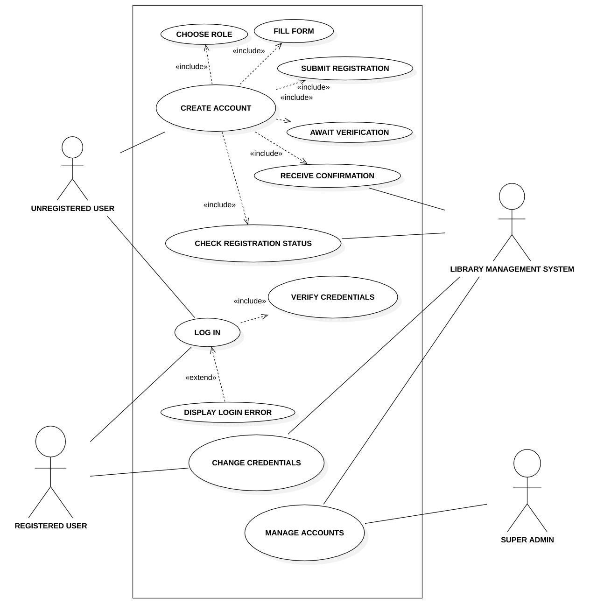
##### Other Functions Use Case Diagram
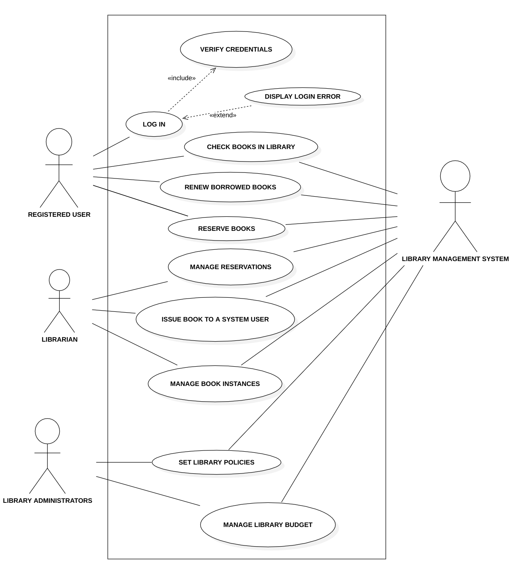

#### 2.2.2 Composition

The LMS is structured into subsystems and components to facilitate maintainability and reusability. A UML component diagram is used to illustrate the high-level structure of the system.

##### Component Diagram
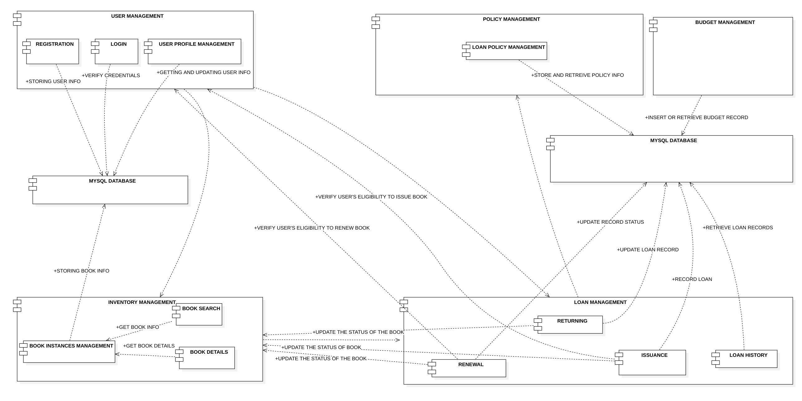

#### 2.2.3 Logical

The static structure of the LMS, including classes, interfaces, and their relationships, is described using UML class diagrams. This provides a detailed view of the system's internal structure.

##### Logical Class Diagram
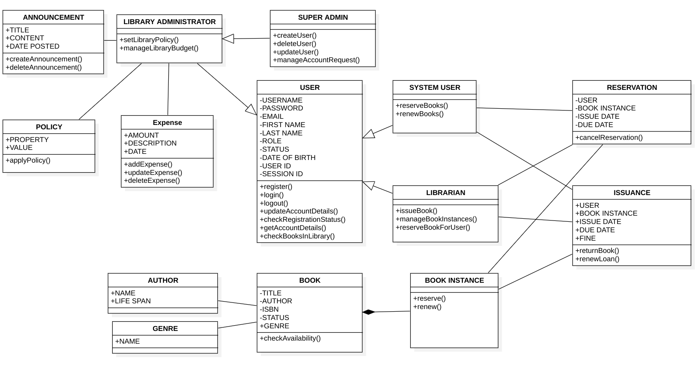

#### 2.2.4 Dependency

The dependencies between different components of the LMS are also illustrated using UML class diagrams. This helps in understanding the system's structure and the impact of changes in one part of the system on others.

##### Dependency Class Diagram
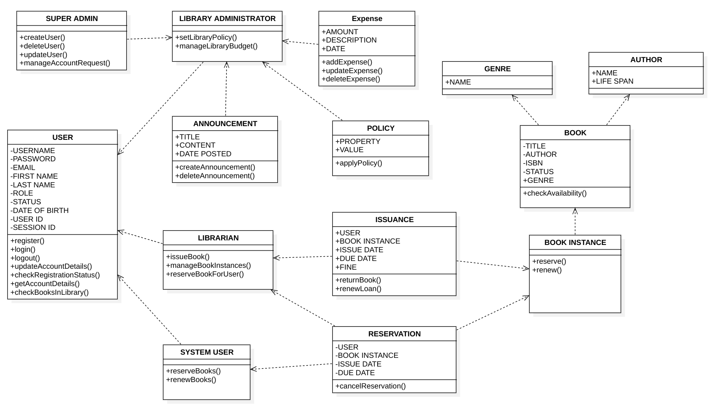

#### 2.2.5 Interface

The interfaces provided by the LMS to its users are represented using wireframes and mockups. This helps in understanding how users will interact with the system.

The following are the mockups for the different interfaces:

##### Desktop Interfaces

- 404 Page
    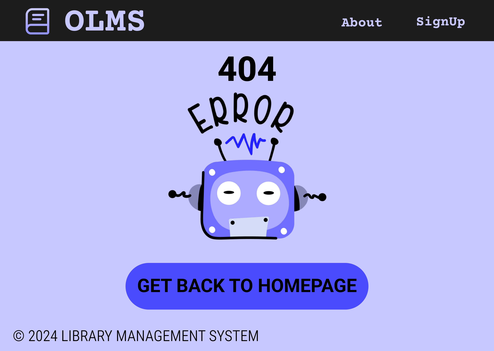
- Admin Interface
    
- Author Interface
    
- Book Interface
    
- Dashboard Interface
    
- Genre Interface
    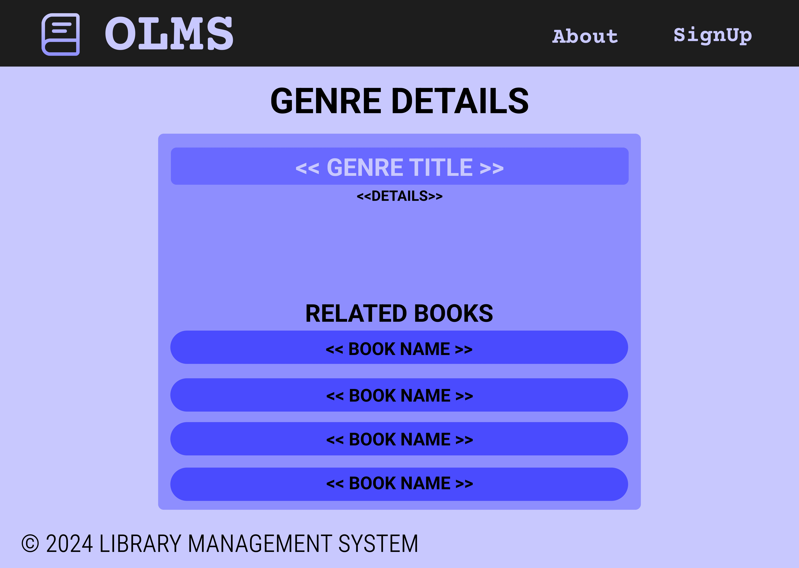
- Instance Interface
    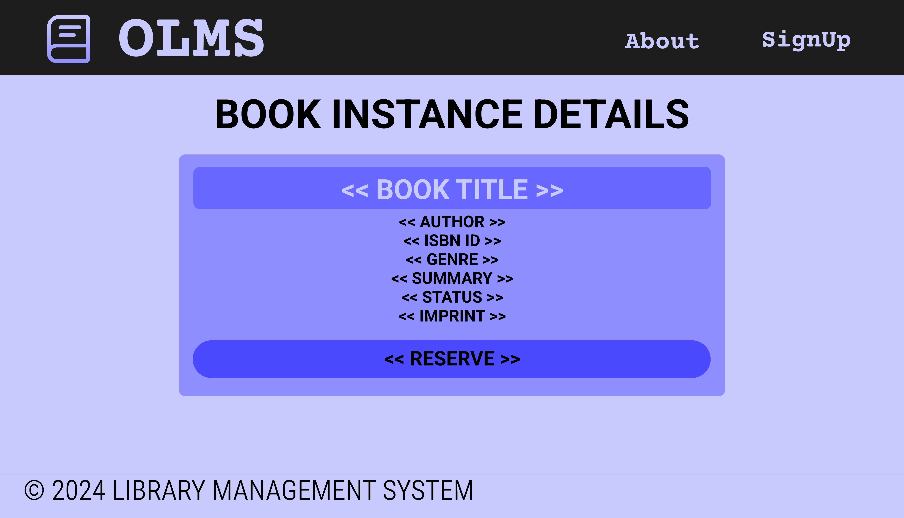
- Librarian Interface
    
- Login Interface
    
- Profile Interface
    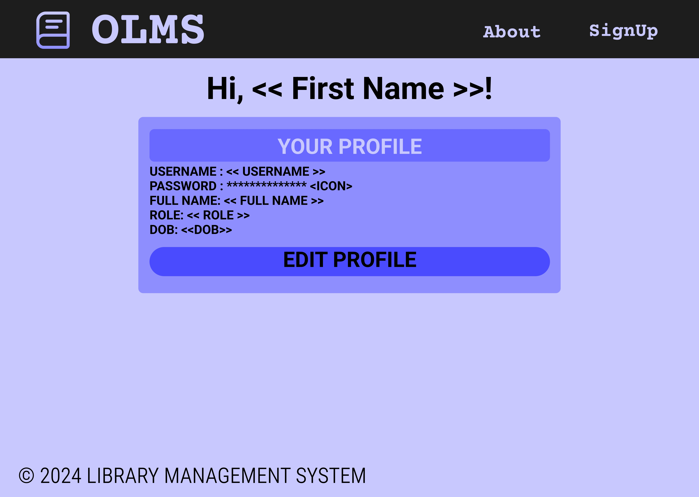
- Reader Interface
    
- Signup Interface
    
- Super Admin Interface
    

##### Phone Interfaces

- 404 Page
    
- Admin Interface
    
- Author Interface
    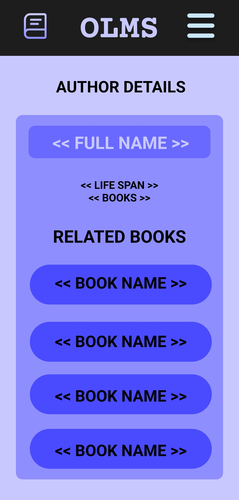
- Book Interface
    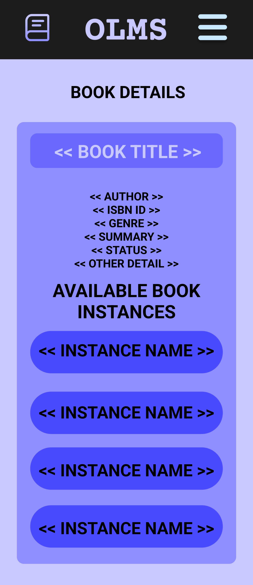
- Dashboard Interface
    
- Genre Interface
    
- Instance Interface
    
- Librarian Interface
    
- Login Interface
    
- Profile Interface
    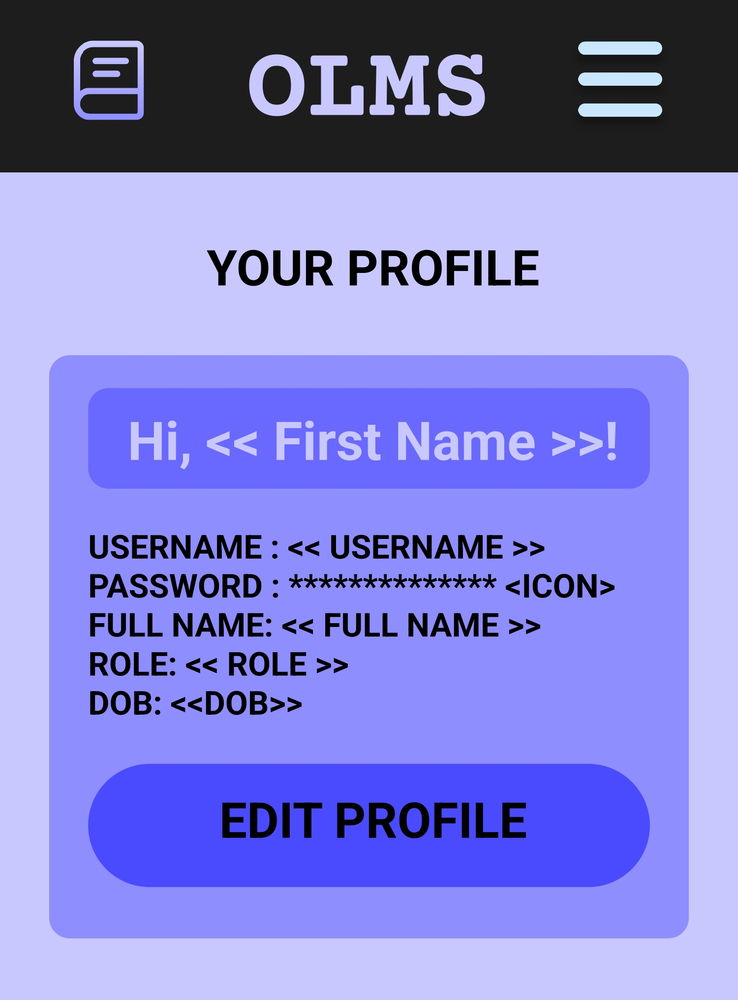
- Reader Interface
    
- Signup Interface
    
- Super Admin Interface
    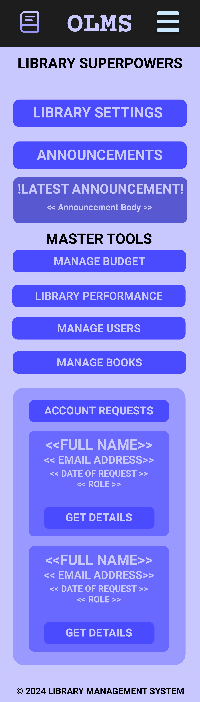

#### 2.2.6 Deployment

The deployment of the LMS in a production environment is illustrated using a UML deployment diagram. This provides information about the system's hardware and software requirements, and how it will be installed and configured.

#### 2.2.7 Resources

The Library Management System utilizes various resources to function effectively:

- **MySQL Database**: The system uses a MySQL database to store all the data related to users, books, reservations, and administrative details. The database is hosted on a cloud-based server and is accessed through the application logic on the server-side.

- **Heroku Cloud Server**: The application and database are hosted on a cloud server provided by Heroku. This allows the system to be accessed from anywhere and provides scalability and reliability.

- **Node.js, Express.js, and React.js**: The system uses Node.js for server-side operations, Express.js for handling HTTP requests and routing, and React.js for building the user interface.

- **JWT**: The system uses JSON Web Tokens (JWT) for user authentication. This allows the system to securely transmit information between parties as a JSON object.

- **File System**: The system uses the server's file system to store temporary data and logs. This includes data related to ongoing transactions and logs for debugging and auditing purposes.

These resources are integral to the operation of the Library Management System and are managed and utilized by the system's components as needed.

##### Deployment Diagram
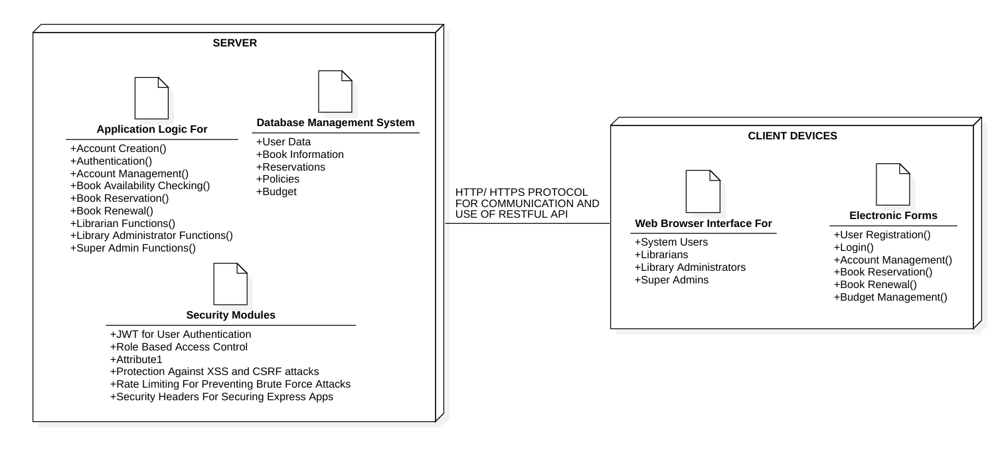

### 2.3 Views
The design of the Library Management System is presented from several different views to provide a comprehensive understanding of the system's architecture and design.

#### 2.3.1 User Interface View
This view presents the design of the system's user interface. It includes mockups of the different interfaces provided by the system, such as the login interface, signup interface, dashboard interface, and admin interface. This view is intended for front-end developers and UI/UX designers. For detailed mockups of the interfaces, refer to the [Interface section](#2.2.5-Interface) under Selected Viewpoints.

#### 2.3.2 Database View
This view presents the design of the system's database. It includes the database schema, showing the different tables in the database, their fields, and the relationships between them. Detailed information about the database schema can be found in the [Data Dictionary](./DataDict.csv). This view is intended for back-end developers and database administrators.

#### 2.3.3 Server View
This view presents the design of the server-side components of the system. It includes the application logic for handling different operations, such as user registration, login, book reservation, and book renewal. The server-side components are implemented using Node.js and Express.js, with routes defined for each operation and middleware used for error handling and request processing. This view is intended for back-end developers.

#### 2.3.4 Security View
This view presents the design of the system's security features. It includes the use of JWT for user authentication, role-based access control for authorization, and various measures for protecting against attacks. User passwords are hashed before being stored in the database, and JWT is used to securely transmit information between the client and the server. Role-based access control is implemented to ensure that users can only perform actions that they are authorized to perform. This view is intended for security engineers and back-end developers.

Each view is represented using appropriate diagrams and descriptions, and includes a record of the relevant design decisions made as they relate to the elements of the view.

## 3. Appendixes

### 3.1 Data Dictionary
A detailed data dictionary for the MySQL database used by the Library Management System can be found [here](./DataDict.csv). This includes a list of all tables in the database, their fields, and the relationships between them.

### 3.2 Glossary
- **LMS**: Library Management System
- **SDD**: Software Design Document
- **MVC**: Model-View-Controller
- **JWT**: JSON Web Tokens, a standard for securely transmitting information between parties as a JSON object
- **Node.js**: A JavaScript runtime built on Chrome's V8 JavaScript engine, used for developing server-side and networking applications
- **Express.js**: A web application framework for Node.js, used for building web applications and APIs
- **React.js**: A JavaScript library for building user interfaces, maintained by Facebook and a community of individual developers and companies
- **MySQL**: An open-source relational database management system
- **Heroku**: A cloud platform as a service supporting several programming languages, used for deploying, managing, and scaling applications